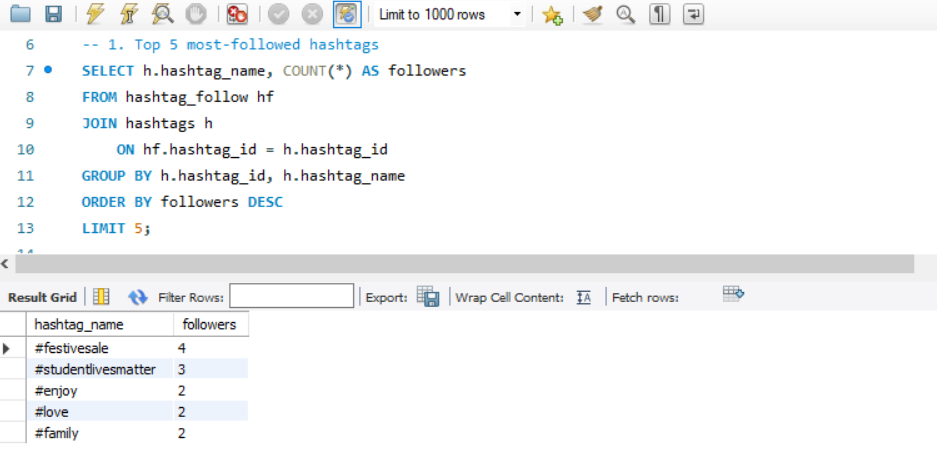
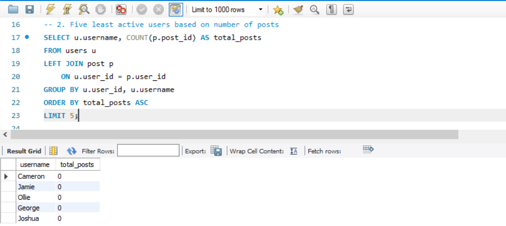
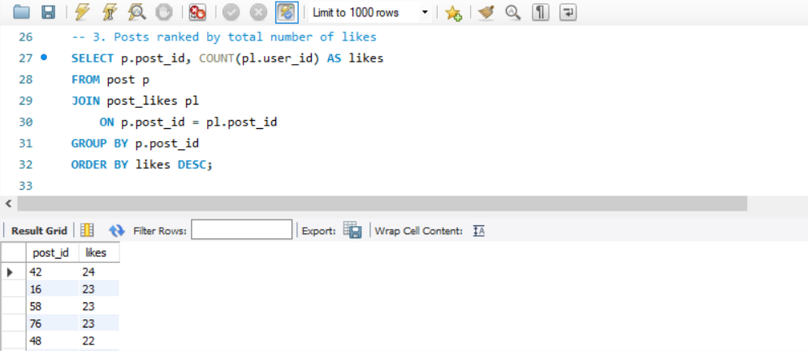

# Social Media Analysis

A beginner SQL project completed during Tuwaiq Academy training .

# About

Analyzing social media data such as users, posts, likes, and hashtags using SQL .

# Skills Practiced

- SELECT
- JOIN
- GROUP BY
- Aggregate Functions
- Subqueries

## Sample Results
### Top Followed Hashtags

### Least Active Users

### Top Liked Posts

